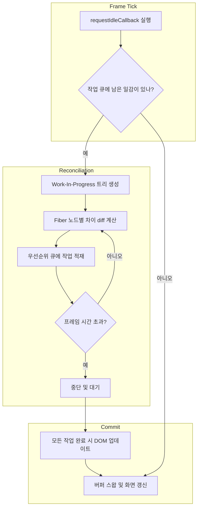

👻 액션아이템 - 실천해볼만한 것

하은

- [x]  [꼭하기,,]createDocumentFragment 살펴보기
- [x]  [꼭하기,,]offsetWidth 이외에 속성을 읽는것만으로도 reflow가 발생할 수 있는 것들 찾아보기
    
    ✔️ offsetWidth / offsetHeight
    ✔️ clientWidth / clientHeight
    ✔️ scrollWidth / scrollHeight
    ✔️ scrollTop / scrollLeft
    ✔️ offsetTop / offsetLeft
    ✔️ getBoundingClientRect()
    ✔️ getComputedStyle()
    
- [x]  [replay.io](http://replay.io) 를 살펴보기
- [ ]  더블 버퍼링과의 연관성에대해서 더 깊게 살펴보기
- [x]  FiberRootNode는 항상 루트노드가 되는 것인지
- [x]  조건부 렌더링에서, 배치 & 삭제가 이루어지는게 더 나을지(ex. isA ? <A/> : <B/>), 업데이트만 이루어지는게 더나을까? (<A isA={true or false} />)
    
    ## ✨ 커밋 단계에선 무엇이 중요한가?
    
    - **상태 유지가 중요하거나 애니메이션/포커스 등 continuity가 필요할 때는**
        
        → `<A isA={true or false} />` 형태가 더 적합
        
    - **서로 다른 책임을 가진 뷰를 명확히 구분하거나 side effect가 분리돼야 할 땐**
        
        → `isA ? <A /> : <B />`가 더 적절
        
        → mount/unmount를 명확히 발생시키는 게 오히려 클린한 경우도 있어
        

정민

- [x]  [replay.io](http://replay.io) 살펴보기
- [ ]  파이버 재조정자에 대한 장점과 동작 원리 정리 → 블로그 또는 구현 (15v → 16v)
    - [ ]  더블 버퍼링
- [ ]  회사 내에 리액트 16 미만인 버전이 있는지 찾아보기 (파이버 전 버전)
- [x]  파이버 동작을 mermaid같은 것으로 만들어보기 (시각화)

- [ ]  4장 다시 읽어보기

### 북스터디 진행 방식

1. 다음주에 이전주의 액션아이템을 실천했다면 경험을 공유해보기, 이야기 나눠보기
2. 문장 혹은 이야기하고 문단까지 읽어보기, 한 페이지씩 읽어보기 (챕터는 유동적으로)
    1. 한 사람 3페이지 읽고 1~2분 타이필 → 다시 읽기
    2. 3~5분 정도 회고 시간 가지기
3. 하은 → 정민 다 읽고 회고 하고 액션아이템 찾아보기

# Chapter 5 자주 묻는 질문과 유용한 패턴

하은

- React.memo를 사용한 메모화
    - 메모화는 컴퓨터 과학에서 이전에 계산된 결과를 캐싱해서 함수의 성능을 최적화하는 기법
    - 입력을 기준으로 함수 출력을 저장했다가, 같은 입력에 대해서 캐시된 결과를 출력함 → 함수의 순수성이 필요함
    - 리액트에서는 함수 컴포넌트에 memo를 사용하 메모화를 적용할 수 있음, 렌더링한다 == 함수를 다시 호출한다
    - 메모로 감싸진 함수는 props가 변경되지 않는 한 재조정 과정에서 다시 호출되지 않음
    - 따라서 비용이 큰 계산을 저장했다가 동일 입력에 대해 저장한 결과를 반환해서 렌더링이 오래걸리는 문제를 방지
    - 컴포넌트에서 상태 변경이 발생하면, 재조정 과정에서 하위트리에 있는 모든 함수 컴포넌트가 다시 호출되는 것은 핵심
    - 필요한 props만 받는게 중요할 것 같음..
- React.memo에 능숙해지기
    - 업데이트가 발생하면, 컴포넌트를 이전 렌더링에서 반환된 가상 DOM과 비교함
    - 재조정자는 엘리먼트가 호스트환경에 이미 존재하는 경우 업데이트하고, 아닌경우 배치효과를 실행함
    - 또는 props가 동일하더라도 컴포넌트는 다시 렌더링되고 이에 따라 DOM도 업데이트됨
    - 이때 memo를 이용하면, 각 렌더링 사이에 컴포넌트 props이 동일한 경우 불필요한 렌더링을 막을 수 있음
    - 얕은 비교라면, 프롭이 너무 중첩 객체여도 안될 것 같음
- 스칼라(원시타입)
    - 스칼라타입은 기본 자료형, 단일한 개별 값을 표현함 → 숫자, 문자열, 불리언, 심볼, 빅인트, undefined, null
    - 

정민

- 메모화, 지연 로딩, 성능을 강화하기 위해 일반적인 리액트 질문의 답을 찾아본다.
- 메모화는 컴퓨터 과학에서 이전에 계산된 결과를 캐싱해서 함수의 성능을 최적화하는 기법입니다.
    - 간단히 말해 메모화는 입력을 기준으로 함수의 출력을 저장해 두었다가 같은 입력을 사용해 함수를 다시 호출하면 출력을 다시 계산하지 않고 캐시된 결과를 반환한다.
    - 함수가 주어진 입력에 대해 동일한 출력을 예측 가능하게 반환해야 한다.
- 네트워크 통신 같은 부작용에 의존한다면 메모화할 수 없다.
- 메모화는 비용이 많이 드는 계산을 처리하거나 항목이 많은 목록을 렌더링 할 때 유용하다.
- 렌더링 한다는 말은 곧 함수를 다시 호출한다는 의미이다.
    - 리액트 컴포넌트는 재조정을 위해 호출되는 함수이다.
- 재조정 과정에서 하위트리에 있는 모든 함수가 다시 호출 되는 것은 리액트 작동 원리의 핵심입니다.
- 중첩된 컴포넌트가 복잡하다면 렌더링 비용이 많이 들 수 있습니다.
    - react.memo를 사용해 중첩된 각 컴포넌트를 메모화하면 이 컴포넌트를 최적화할 수 있습니다.
- react.memo는 리액트에서 함수형 컴포넌트의 성능을 최적화 하는데 필수적인 도구 입니다. 렌더링 비용이 많이 들거나 로직이 복잡한 컴포넌트에 특히 유용하다.
- memo는 업데이트가 발생하면 리액트는 컴포넌트를 이전 렌더링에서 반환된 가상 DOM의 결과와 비교한다.
- memo는 프롭에 얕은 비교를 수행해 프롭의 변경 여부를 확인한다.
    - 문제는 자바스크립트에서 스칼라 타입은 매우 정확하게 비교할 수 있지만, 스칼라가 아닌 타입은 그렇지 않다.
- 스칼라(원시 타입)이라고 부르기도 하는 스칼라 타입은 기본 자료형이다.
    - 속성이나 메서드가 없으며 본질적으로 불변하다.
        - 새로운 값을 만들지 않고는 변경하지 못한다.

🥳 좋았던점 또는 알게된점(내용)

하은

- 메모화라는 개념은 컴퓨터 과학에서 얘기하는 기법 중 하나
- 이를 위해서는 함수의 순수성이 중요하다는 점은 몰랐던 건 아니지만, 이렇게 정의할 수 있는지는 새삼 다르게 느껴지기도하네,,
- 렌더링 == 함수호출
- 메모한 예제를보니 더더욱 필요한 프롭스를 받는게 중요하다고 느껴짐

정민

- 메모화는 컴퓨터 과학에서 이전에 계산된 결과를 캐싱해서 함수의 성능을 최적화하는 기법입니다.
- react.memo를 사용하는 방법에 대해서 알아보고 왜 써야하는지 알게된다.
- react.memo는 리액트에서 함수형 컴포넌트의 성능을 최적화 하는데 필수적인 도구 입니다. 렌더링 비용이 많이 들거나 로직이 복잡한 컴포넌트에 특히 유용하다.
- 스칼라 타입

🥲 아쉬운점 또는 의문인점(내용)

하은

- 얕은비교로 변경여부를 판단한다고 했는데, 리액트 컴파일러도 memo를 알아서 해주니까, 결국 얕은 비교한다는것과 동일한가?
- 이게 맞다면 컴파일러를 쓰더라도 중첩된 객체의 경우에는 성능상 이점을 챙길 수 없지 않나 싶음
- 그럼 객체의 경우,,? 아마 다음장에 나오려나,,

정민

- 아직까진 memo를 너무 잘 쓰는 예시로만 나타내고 있다.
    - 공식문서는 쓰는경우 잘 없을거라는데?

👻 액션아이템 - 실천해볼만한 것

하은

- 중첩 객체의 경우 memo가 어떻게 동작하는지 살펴보자

정민

- memo는 얕은 비교를 한다는데, 깊은 비교를 하는 경우는 있는지 찾아보기
- 원시 타입 찾아보기
- useMemo → memo의 동작

# Chapter 5. 자주 묻는 질문과 유용한 패턴 - 스칼라가 아닌 타입

하은

- 참조타입
    - 스칼라가 아닌 타입, 데이터 자체가 아니라 메모리에 저장된 위치에 대한 참조 또는 포인터를 저장함
    - 자바스크립트에서는 객체와 배열, 함수 등 → 여러 참조가 동일한 메모리 위치를 가리킬 수 있다는 점
    - 하나의 참조를 통해 데이터를 수정하면 동일한 데이터를 가리키는 다른 참조에도 영향이 있음
    - 참조 타입을 비교할 때는 메모리 참조를 기준으로함 << 중요
    - 값이 같더라도, 컴퓨터 메모리에서는 메모리 위치가 동일한지 확인함
    - 컴포넌트 내부에서 상태가 변경될 때마다, 컴포넌트가 렌더링되는데 이때 자식 컴포넌트의 props 값이 변하지 않았더라도 매번 새 인스턴스가 생성되어 자식컴포넌트를 불필요하게 다시 렌더링함 → useMemo로 변수를 메모화하면 문제가 해결됨
    - 함수도 참조로 비교하기 때문에, 함수를 메모화하려면 useCallback 훅을 이용해서 해결함
- 강제가 아닌 권장사항
    - React.memo를 재조정자에 대한 힌트로 사용해 리액트가 다시 렌더링하지 않도록 함
    - 리액트는 우리가 원하는 것을 설명하는 사용자 인터페이스의 선언적 추상화로 의도되었음
        - 따라서 이를 수행하는 최선의 방법을 찾아내는 것은 리액트의 몫, memo도 이런 과정의 일부
    - memo가 항상 리렌더링을 방지하는 것이 아님
- memo
    1. 초기 점검, 현재 파이버와 작업중인 파이버,컴포넌트, 새프롭, 업데이트 우선순위와 렌더레인 등 여러 인수를 받음 초기 검사를 통해 초기 렌더링인지 결정함
    2. 단순 함수 컴포넌트인지 확인해서 빠른 경로 업데이트가 가능한지 확인함
    3. 개발모드인 경우에는 경고 메세지를 표시함
    4. 최초 렌더링인 경우, 새 파이버를 생성하고 자식을 반환함
    5. 컴포넌트가 업데이트중인경우 개발모드 검사와 유사항 동작을 수행함, 얕은 비교나 사용자 정의 비교 기능으로 이전 프롬과 새 프롭을 비교해 업데이트 가능 여부를 확인
    6. 프롭이 동일하고 참조가 변경되지 않은 경우, 업데이트 작업에서 벗어나고 렌더링 작업을 더 진행하지 않음
    7. 업데이트가 필요한 경우, 작업용 파이버에 플래그를 설정하고 현재 자식기반으로하되 새 프롭이 포함된 새로운 작업용 자식 파이버를 생성함

정민

- 스칼라의 단순함을 넘어가면 참조 타입 이라고도 하는 스칼라가 아닌 타입을 만나게 됩니다.
- 이 타입은 데이터 자체가 아니라 데이터가 메모리에 저장된 위치에 대한 참조 또는 포인터를 저장한다.
- 왼쪽 배열의 위치에 대한 참조가 오른쪽의 메모리 위치가 동일한지 확인한다.
    - 배열 비교의 값은 false가 된다.
- name, url, onChange 프롭은 모두 상숫값이므로 외부의 상태가 변경되어도 프롭이 변경되지 않을 것 처럼 보이지만, 프롭을 비교해 보면 다음 결과를 얻게 됩니다.
    - 함수를 참조로 비교하기 때문에 false가 된다.
    - 이때는 useCallback을 사용하면 된다.
- react.memo를 재조정자에 대한 힌트로 사용해 컴포넌트의 프롭이 동일하게 유지되면 다시 렌더링하지 않도록 합니다.
- react.memo는 함수는 리액트에 힌트를 전할 뿐 입니다.
    - 모든 작업은 리액트의 책임이다.
- 컴포넌트 트리의 변경이나 애플리케이션의 전역 상태 변경이 발생하면, 리액트가 메모화된 컴포넌트를 다시 렌더링 할 수 있으므로 react.memo가 항상 리렌더링을 방지하는 것 은 아니다.

react.memo의 코드

1. 초기 점검
    - 현재 파이버, 작업중인 파이버, 컴포넌트, 새 프롭, 업데이트의 우선 순위와 타이밍을나타내는 렌더레인 등 여러 인수를 받는다.
    - 초기 렌더링인지 아닌지 결정한다.
2. 타입 및 빠른 경로 최적화
    - 단순 함수 컴포넌트이고 빠른 경로 업데이트가 가능한지 확인한다.
3. 개발 모드 확인
    - 개발 모드에서 프롭타임에 유효성 검사를 수행하고, 추가 검사를 통해 사용되지 않는 기능에 경고를 표시한다.
4. 새로운 파이버 생성
    - 최초 렌더링인 경우 새 파이버를 생선한다. 이 파이버는 리액트 렌더러를 위한 작업 단위를 의미한다.
5. 기존 파이버 업데이트
    - 컴포넌트가 업데이트 중인 경우 개발 모드와 유사한 동작을 수행한다.
    - 그후 얕은 비교 또는 사용자 정의 비교 기능으로 이전 프롭과 새프롭을 비교해 컴폰언트가 업데이트가 필요한지 확인한다.
6. 업데이트 종료
    - 프롭이 동일하고 변경되지 않은 경우, 업데이트 작업에서 벗어날 수 있다.
7.  작업용 파이버 업데이트
    - 업데이트가 필요한 경우 작업용 파이버에 플래그를 설정한다.
    - 현재 자식을 기반으로 하되 새로운 프롭이 포함된 새로운 작업용 자식 파이버를 생성한다.

🥳 좋았던점 또는 알게된점(내용)

하은

- memo 라는 함수 자체가 멋진 최적화를 한다기보단, 리액트에게 최적화가 필요해~ 라고 하는 힌트를 제공하는 것,이 힌트를 통해서 리액트는 리렌더링을 하지 않도록 한다
- 모든 작업은 리액트의 책임
- 부모로부터 전파되는 불필요한 리렌더링을 피하기위해서 만들어진 것이지 절대 리렌더링되지 않는 것은 아니다
- 코드를 직접 설명할 거라고 생각하지 못하긴함
- updateMemoComponent는 프롭을 얕게 비교해서, 컴포넌트 업데이트가 필요한지안한지에 대한 플래그를 생성하고 작업용 파이버를 생성하는 것

정민

- 스칼라가 아닌 타입은 타입은 데이터 자체가 아니라 데이터가 메모리에 저장된 위치에 대한 참조 또는 포인터를 저장한다.
- 왼쪽 배열의 위치에 대한 참조가 오른쪽의 메모리 위치가 동일한지 확인한다.
- react.memo는 함수는 리액트에 힌트를 전할 뿐 입니다.
    - 모든 작업은 리액트의 책임이다.
- memo에 대한 동작을 자세하게 알아보아서 좋았다.

🥲 아쉬운점 또는 의문인점(내용)

하은

- 

정민

- 배열을 메모리가 아닌 값으로 비교를 왜 안 했을까?

👻 액션아이템 - 실천해볼만한 것

하은

- updateMemoComponent 함수를 더 살펴보고 이해해보기
- 관점을 달리해서 코드들을 바라보기

정민

- react.memo 에 대해서 코드 한번 더 살펴보기
    - ai랑 같이해봐도 좋을듯
- 배열을 메모리가 아닌 값으로 비교를 왜 안했을까?
    - 알아보기..?

→ 일부로 메모리 비교! 성능에 문제가 생길 수 있다.

👻 액션아이템 - 실천해볼만한 것

하은

- [ ]  중첩 객체의 경우 memo가 어떻게 동작하는지 살펴보자
- [ ]  updateMemoComponent 함수를 더 살펴보고 이해해보기
- [ ]  관점을 달리해서 코드들을 바라보기

정민

- [ ]  memo는 얕은 비교를 한다는데, 깊은 비교를 하는 경우는 있는지 찾아보기
- [ ]  useMemo → memo의 동작 같은 걸지? (usememo, useCallback은 잘 사용하지 않는 부분으로 이해했었는데)
- [ ]  원시 타입 찾아보기
- [ ]  react.memo 에 대해서 코드 한번 더 살펴보기 (ai랑 같이해봐도 좋을듯)
- [ ]  배열을 메모리가 아닌 값으로 비교 (이 부분은 간단히 확인해보기)